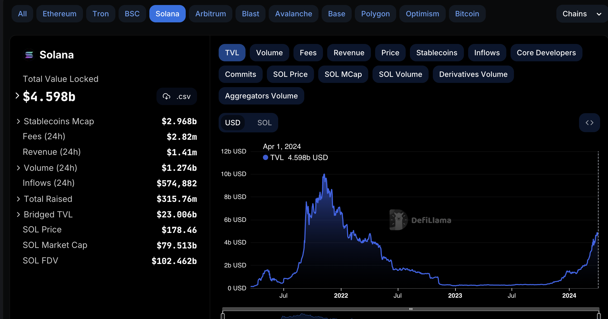

# Lesson 6 Notes and Links

Instructor notes [they are detailed and have screenshots]:
 - [Instructor Notes](../instructor_slide_notes_and_homework/Lesson6.pdf)
 - [Homework](../instructor_slide_notes_and_homework/Homework6.pdf)

### Slido for class questions:
https://app.sli.do/event/9bhfXBfjYd6QpmY3g8tQLZ

### AI Notes

Ask for permission

https://otter.ai/u/xWKQ3Ma_WAv6pFS9PJW5Sy1yWoE?utm_source=va_chat_link_1

https://otter.ai/u/WJvewMRMLP2CU8eXhHut-2obpl0?utm_source=va_chat_link_1

## Notes

 - DeFi
  - Compound lending
  - Flash loans

YOU ARE NOT BULLISH ENOUGH

 - Covered Token and Token-2022
  - TODO: Dive deeper on the docs
    - https://spl.solana.com/token

## Links

defillama [Solana]
https://defillama.com/chain/Solana

TODO research token 2022
- https://spl.solana.com/token-2022
- https://spl.solana.com/token-2022/status
- https://github.com/solana-labs/solana/issues/32613
- https://docs.solanalabs.com/runtime/zk-token-proof

## Homework

